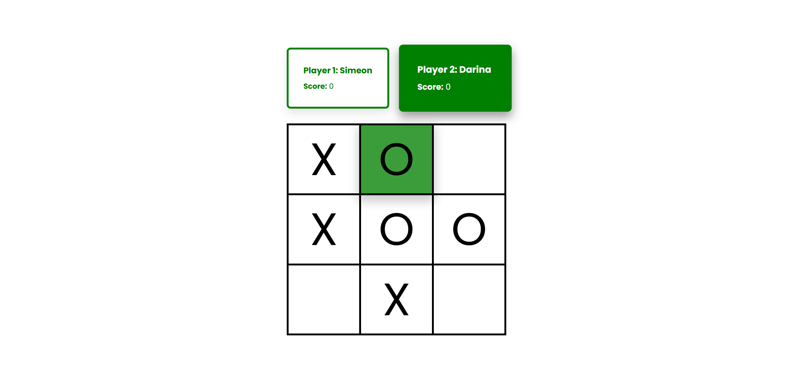
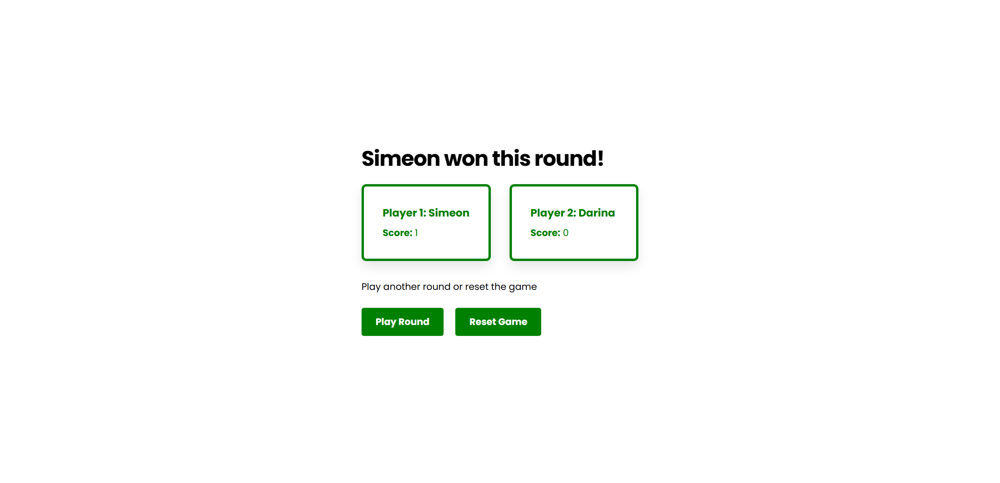

# Project

This is a tictactoe game with focus on creating separations of concern between application logic and UI. The UI should merely just update the state and invoke applicaiton logic and react upon it by reading f.e. state

**Live demo: [Website](https://simeon2002.github.io/TOP-tic-tac-toe/)**

# App views

Three screens, a home screen, game screen, and end of round screen are implemeneted with interactions as well:

  
  

  
  

# Mistakes

1. The UI behavior is coupled to the game logic, before I added game logic to the UI behavior (changing state with click handlers). This time, I let the game logic modify UI state but this shouldn't be done since it's not responsible for it. I should should give back a result from the game logic based on which the display class (which is responsible for handling events and updating the UI) will then display different UIs as a result.

# Implementation details

- Use of factory functions to create classes and encapsulation only exposing a public API
- Use of module pattern for the same purpose but to only create a single with which can be interacted
  Use of closures

# Main Learnings

- Learning that we need separation of concerns to make the code more readable and understandble. This is done by making different classes responsible for something (f.e. application logic and state responsibility vs UI controller responsibility)
- Use of closure with facotry functions and module patterns to implement classes (+ use of composition)
- Handling UI states based on the application states
- I understood closures, mostly because I understand lexical scoping, but the wording around it was confusing. Now I know that a closure is essentially a function that has access to the variables defined in its outer scopres (lexical environment/scope chain). This is made possible by lexical scoping (variable accessibilitiy is based on where they are defined). This is in contrast to dynamic scoping.
- Abstraction of implementation details into functions. F.e. a controller function consists of multiple steps where each steps' implementation details are abstracted away -> makes code easier to read!

# Future todo's

- implement restart game functionality (easy)
- implement asking player name (easy)
- implement general grid (medium) -> code has been constructed to keep this in mind.
